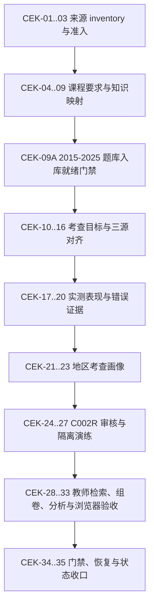

# 课程标准与中考真题多层证据提炼实施计划

- 日期：2026-07-28
- 状态：CEK-01..35 本机 repo-side 实施与状态收口已完成；真实教师签字、身份授权、学校网络、隔离机、生产切换和 `REAL005` 仍未完成
- 设计依据：`docs/superpowers/specs/2026-07-28-curriculum-exam-knowledge-extraction-design.md`
- 当前范围：初中物理、2022 年版 2025 年修订课程标准、广州 2015-2025 中考真题/答案/年报
- 计划性质：现有知识资产治理和广州真题闭环的下级专题计划，不新增顶层路线图

## 1. 实施目标与完成边界

本计划把已批准的多层证据模型落到现有 PostgreSQL、动态领域资产、QuestionItem/QuestionBlock、C002R、API/Web 和证据门禁中。最终形成可追溯的链路：

```text
SourceDocument / SourceRegion
-> CurriculumRequirement / RequirementFacet
-> KnowledgeNode / Knowledge mapping
-> Question scope / AssessmentTarget
-> ObservedPerformanceEvidence / Error evidence
-> RegionalExamPointProfile
-> Search / Paper / Analysis / Teaching review
```

本计划完成不自动等于生产激活、教师验收或项目发布：

- 所有机器提炼结果默认 `candidate/pending_review/productionEligible=false`。
- 生产 `C002 active` 不在本计划中自动切换；只完成候选、审核、影响报告以及隔离库激活/回滚演练，并输出管理员决策包。
- `REAL005=not_closed`、P001/P003/P005/P006 待办和现场/人工验收边界保持不变，除非后续真实证据另行满足其合同。
- `tasks/plan.md` 中既有 T7d-T10 和 `tasks/live-pilot-closeout-plan.csv` 的 P001 -> P006 顺序不被本计划替换。
- `tools/run-gates.ps1` 会使用 PostgreSQL 并可能暂停/恢复 API；执行 CEK-34 前必须再次获得当前任务明确确认。

## 2. 架构落点

| 领域语义 | 实施落点 | 兼容边界 |
| --- | --- | --- |
| `KnowledgeNode` | 继续使用 `knowledge_nodes` 和当前 C002 版本化知识资产 | 不用课标条目或单题目标替代知识节点 |
| `CurriculumRequirement` / `RequirementFacet` | 使用 `domain_asset_versions` 的新语义类型和结构化 metadata/sourceEvidence | 导出时继续兼容 `curriculum_standard_item` CSV/API 名称 |
| `EvidenceAnchor` | 作为 `SourceDocument + SourceRegion + SourceRegion.Metadata` 的结构化引用合同 | 首版不增加独立图表或图数据库 |
| `AssessmentTarget` | 新增题目范围实体、知识映射和课标对齐关系表 | 旧 `QuestionItem.CustomFields` 候选字段保留只读兼容 |
| `ObservedPerformanceEvidence` | 新增正式统计证据表，公共指标列化，来源特有分布保留 JSON | 不覆盖 `QuestionItem.DifficultyEstimated` |
| `ObservedErrorEvidence` / `TeachingRecommendation` | 新增来源证据实体 | 单次错误不能自动变成 misconception |
| `ErrorPattern` | 使用 `domain_asset_versions` 的 `error_pattern` candidate | 提升为知识资产 misconception 必须另走审核 |
| `RegionalExamPointProfile` | 继续使用存储/API 类型 `exam_point`，metadata 收紧为地区多年画像 | 旧筛选参数继续可用，UI 改用“地区考查画像”表述 |

`QuestionBlock` 承担可引用的小问/评分点范围：整题目标的 block 为空，小问目标引用 `subquestion` block，评分点目标引用 `scoring_point` block。无法可靠拆分时只保留整题目标，不制造评分点事实。

## 3. 依赖图与执行规则



执行纪律：

1. 每个任务独立提交，或在同一检查点内合并为一个仍可独立回滚的最大合理切片。
2. 每项先跑 dry-run/fixture，再允许本地数据写入；数据库写入前必须有已验证 backup manifest。
3. 依赖、schema 或迁移失败立即停在当前任务，不带病进入下一检查点。
4. 新依赖只在 CEK-06 的真实 golden fixture 证明当前工具不足时评估；必须记录许可证、锁定版本、Windows/离线能力、卸载方式和对比证据。
5. 每个检查点都复核 `candidate/pending_review/no-active-write` 和历史版本可解释性。

## 4. 任务明细

### Phase A：课程标准来源 inventory、迁移与准入

### CEK-01：课程标准来源 inventory 与可逆迁移工具

**描述：** 按现有广州真题 source-batch 模式，为当前 OCR 课程标准建立单文件 inventory、PDF 完整性检查、dry-run、apply、rollback 和 hash parity 合同。

**输入 / 输出：** 输入当前 imported PDF；输出 inventory JSON/CSV、迁移报告和只处理该文件的回滚入口。

**验收：**

- [ ] 固定识别 `materialId=curriculum-physics-junior-2022-2025-revision`，不依赖模糊文件名猜测版本。
- [ ] 报告记录原/目标路径、长度、mtime、SHA-256、PDF magic、67 页和文本字符数；事实漂移时 fail-closed。
- [ ] dry-run 不改文件，目标同名冲突、hash 变化或非 PDF 均阻断。

**验证：** `python -m unittest tests.workers.test_curriculum_standard_source_batch`；`pwsh -NoProfile -ExecutionPolicy Bypass -File tools/run-curriculum-standard-source-batch-stage.ps1`

**依赖：** 无。

**预计写集：** `tools/curriculum_standard_source_batch.py`、`tools/run-curriculum-standard-source-batch-stage.ps1`、`tests/workers/test_curriculum_standard_source_batch.py`、`tools/README.md`。

**证据 / 回滚：** `docs/evidence/cek001-curriculum-standard-source-batch.json`；删除 dry-run 产物即可回滚，源文件未移动。

**规模：** M，4 个仓库文件。

### CEK-02：执行版本目录迁移并更新本地 manifest

**描述：** 在 CEK-01 dry-run 通过后，把 PDF 移到独立课程标准版本目录，并只更新被 Git 忽略的本地来源 manifest。

**输入 / 输出：** 输入 CEK-01 inventory；输出目标目录 PDF、hash parity 报告和本地 manifest 记录。

**验收：**

- [ ] 文件位于 `D:\KQG_Data\source_materials\imported\curriculum_standards\physics\junior_middle_school\2022-2025-revision\raw\`，原 imported 根不再残留该文件。
- [ ] 移动前后 SHA-256 完全一致，目标不存在覆盖写，inventory 可验证 rollback。
- [ ] 本地 manifest 三个用途标志分别为 `true/false/false`，且数据库、FileStore、C002 active 均未写入。

**验证：** `pwsh -NoProfile -ExecutionPolicy Bypass -File tools/run-curriculum-standard-source-batch-stage.ps1 -Apply`；独立 `Get-FileHash`；同一脚本 `-ValidateRollback`。

**依赖：** CEK-01。

**预计写集：** 外部版本目录、`configs/knowledge/source-material-manifest.local.json`、`docs/evidence/cek002-curriculum-standard-migration.json`。

**证据 / 回滚：** 使用 inventory 执行同一 wrapper 的 `-Rollback`，并恢复本次 manifest 备份；只移动本批单文件。

**规模：** S，外部数据与 1 个忽略文件。

### CEK-03：来源准入和 SourceDocument 幂等登记

**描述：** 收紧来源 manifest/导入合同，支持课程标准页数、文本层和用途事实，并在有已验证备份时幂等登记 SourceDocument/FileAsset。

**输入 / 输出：** 输入 CEK-02 本地 manifest；输出 SourceDocument、FileAsset、用途许可和准入报告。

**验收：**

- [ ] authority/version/scope/path/hash/license/PII/用途字段齐全，未授权或路径/hash 不符时不上传。
- [ ] 重复执行按 hash 和 material batch 幂等，不制造重复 SourceDocument。
- [ ] 来源登记不创建知识资产、不运行 AI、不改变任何 active 版本。

**验证：** `pwsh -NoProfile -ExecutionPolicy Bypass -File tools/run-c002-source-material-guard.ps1 -ManifestPath configs/knowledge/source-material-manifest.local.json`；`tools/import-c002-source-materials.ps1` dry-run；有 backup manifest 后运行定向 apply smoke。

**依赖：** CEK-02。

**预计写集：** `apps/api/FileStore/SourceDocumentMetadataPolicy.cs`、`configs/knowledge/source-material-manifest.example.json`、`tools/run-c002-source-material-guard.ps1`、`tools/import-c002-source-materials.ps1`、`tests/api/K12QuestionGraph.Api.Tests/SourceDocumentMetadataPolicyTests.cs`、`tools/README.md`。

**证据 / 回滚：** `docs/evidence/cek003-curriculum-source-admission.json`；导入失败即停止，数据回退使用写前 backup 恢复 database/FileStore，不以 Git 回滚代替数据恢复。

**规模：** M，4 个仓库文件。

## Checkpoint A：来源可追溯

- [ ] CEK-01..03 验证通过，课程标准路径/hash/版本/用途许可一致。
- [ ] 本检查点只证明来源准入，不证明课程要求已经提炼。
- [ ] C002 active 指纹与开始前一致。

### Phase B：课程要求、要求分面与知识映射

### CEK-04：EvidenceAnchor 存储合同与 SourceRegion metadata

**描述：** 给现有 SourceRegion 增加结构化 metadata，使 EvidenceAnchor 可记录印刷页、章节路径、官方条目号、文本块 hash 和证据角色，同时继续复用 SourceDocument/SourceRegion 外键。

**输入 / 输出：** 输入已登记课程标准；输出可被课程要求、题目目标和年报证据共同引用的锚点表示。

**验收：**

- [ ] metadata 为 JSONB，旧 SourceRegion 迁移后默认 `{}`，现有截图/坐标 API 行为不变。
- [ ] 课程标准整页或文本块锚点均能回到 SourceDocument、PDF 页和印刷页。
- [ ] migration 有 Up/Down，索引和删除行为不破坏既有来源区域。

**验证：** `dotnet build apps/api/K12QuestionGraph.Api.csproj`；`dotnet ef migrations script --idempotent --project apps/api/K12QuestionGraph.Api.csproj`；检查生成 SQL 的默认值、索引和 Down 路径。

**依赖：** CEK-03。

**预计写集：** `apps/api/Domain/P0Entities.cs`、`apps/api/Data/KqgDbContext.cs`、新 EF migration `.cs`、对应 `.Designer.cs`、`apps/api/Data/Migrations/KqgDbContextModelSnapshot.cs`。

**证据 / 回滚：** `docs/evidence/cek004-evidence-anchor-migration.json`；执行 migration Down 或恢复 CEK-04 前数据库快照。

**规模：** M，5 个仓库文件。

### CEK-05：CurriculumRequirement / RequirementFacet schema 与模板

**描述：** 建立 JSON Schema、候选模板和合同脚本，明确父条目、分面、行为动词、认知要求、能力维度、知识映射与证据锚点。

**输入 / 输出：** 输入设计文档领域字段；输出可供规则、AI、人工审核和兼容导出的统一结构。

**验收：**

- [x] `source_text`、standard version、official code、requirement type 和 evidence anchors 为必填且不可由摘要替代。
- [x] facet 必须指向一个父 requirement，不能脱离父条目成为知识节点。
- [x] 缺 confidence/review status/production eligibility 或出现未知枚举时 fail-closed。

**验证：** `pwsh -NoProfile -ExecutionPolicy Bypass -File tools/run-curriculum-requirement-contract.ps1`；JSON parse 和负例 fixture。

**依赖：** CEK-04。

**预计写集：** `schemas/evidence_anchor.schema.json`、`schemas/curriculum_requirement.schema.json`、`configs/knowledge/curriculum-requirement-template.json`、`tools/run-curriculum-requirement-contract.ps1`、`tools/README.md`。

**证据 / 回滚：** `docs/evidence/cek005-curriculum-requirement-contract.json`；回滚本任务 schema/template/contract，不影响数据。

**规模：** M，5 个仓库文件。

### CEK-06：OCR 课程标准层级与页码提取

**描述：** 使用现有 pypdf/pdfplumber/worker profile 提取目录、五个一级主题、二级主题、官方条目、PDF 页/印刷页映射和 EvidenceAnchor 候选，不在本任务做语义分面。

**输入 / 输出：** 输入 CEK-02 PDF；输出本地 hierarchy candidate JSON、页级诊断和 golden fixture 报告。

**验收：**

- [x] 五个一级主题存在，官方条目号唯一，父子结构无环，目录/正文锚点可回看。
- [x] 目录、课程内容、学业质量和命题建议代表页均通过文本非空与阅读顺序 fixture。
- [x] 解析不完整时报告 `manual_takeover_required`，不生成缺证据正式条目。

**验证：** `python -m unittest tests.workers.test_curriculum_standard_structure`；`pwsh -NoProfile -ExecutionPolicy Bypass -File tools/run-curriculum-standard-structure.ps1`。

**依赖：** CEK-05。

**预计写集：** `tools/curriculum_standard_structure.py`、`tools/run-curriculum-standard-structure.ps1`、`tests/workers/test_curriculum_standard_structure.py`、`tests/golden-import/curriculum-standard-structure-fixture.json`。

**证据 / 回滚：** `docs/evidence/cek006-curriculum-standard-structure.json`；删除派生候选/缓存即可，原 PDF 和 SourceDocument 不变。

**规模：** M，4 个仓库文件。

## Checkpoint B1：课标结构可靠

- [x] CEK-04..06 通过，所有结构节点有可回看的 EvidenceAnchor。
- [x] 未安装新依赖；当前锁定的 `pypdf==6.14.2` 已满足真实 fixture。
- [x] 尚未生成正式分面或知识映射。

### CEK-07：要求分面候选与 AI schema/eval

**描述：** 在保持原始条文不变的前提下，按“行为动词 + 内容对象 + 条件/表现”拆出 RequirementFacet；规则优先，AI 只补语义候选。

**输入 / 输出：** 输入 CEK-06 hierarchy candidate；输出 facet candidates、字段级来源/置信度和待审队列。

**验收：**

- [x] 一个复合条目可拆多 facet，每个 facet 始终保留 parent 和 source anchor。
- [x] 规则与 AI 输出都满足 schema，模型/prompt/schema version、输入输出 hash 和成本字段可追溯。
- [x] 低于 0.85、复合/冲突或缺字段候选进入人工审核，绝不自动正式化。

**验证：** `python -m unittest tests.workers.test_curriculum_requirement_facets`；`pwsh -NoProfile -ExecutionPolicy Bypass -File tools/run-curriculum-requirement-extraction-eval.ps1`。

**依赖：** CEK-06。

**预计写集：** `schemas/ai/curriculum_requirement_extraction.schema.json`、`configs/ai-evals/curriculum-requirement-extraction.sample.json`、`tools/curriculum_requirement_facets.py`、`tools/run-curriculum-requirement-extraction-eval.ps1`、`tests/workers/test_curriculum_requirement_facets.py`。

**证据 / 回滚：** `docs/evidence/cek007-curriculum-requirement-extraction-eval.json`；删除本批 candidate，不动 source_text 或 active。

**实施真值：** 固定 CEK-06 候选的 89 条要求生成 184 个规则 facet；53 条复合要求与 31 个低置信度 facet 已进入待审，blocked 为 0。离线 AI golden 及 6 个负例通过，真实模型调用、数据库/SourceRegion/knowledge/C002 active 写入均为 0。规则和合成 AI 输出只存在 `tmp/cek007`，提交证据不含真实条文。

**规模：** M，5 个仓库文件。

### CEK-08：课程要求到知识节点的候选 crosswalk

**描述：** 将 requirement/facet 与当前 C002 KnowledgeNode 做多对多候选映射，并生成旧 `curriculum_standard_item` / asset-mapping 兼容输出。

**输入 / 输出：** 输入 CEK-07 candidates 和当前 active C002 快照；输出 crosswalk、未匹配新知识候选及影响分类。

**验收：**

- [x] 课程要求到知识资产只用 `equivalent/broader/narrower` 表达语义范围；前置知识不混入 DomainAssetMapping 枚举。
- [x] 未匹配内容只生成 `knowledge candidate`，不得新增 active KnowledgeNode。
- [x] 一拆多、多合一、多对多、低置信度和高影响项均标记人工审核与 rollback requirement。

**验证：** `python -m unittest tests.workers.test_curriculum_knowledge_crosswalk`；`pwsh -NoProfile -ExecutionPolicy Bypass -File tools/run-curriculum-knowledge-crosswalk.ps1`。

**依赖：** CEK-07。

**预计写集：** `tools/curriculum_knowledge_crosswalk.py`、`tools/run-curriculum-knowledge-crosswalk.ps1`、`tests/workers/test_curriculum_knowledge_crosswalk.py`、`schemas/ai/knowledge_mapping.schema.json`、`configs/knowledge/c002-asset-mapping-template.csv`。

**证据 / 回滚：** `docs/evidence/cek008-curriculum-knowledge-crosswalk.json`；丢弃 crosswalk candidate 和兼容导出。

**实施真值：** 基于 Git 忽略的 CEK-07 184 个 facet，以及从 `domain_asset_versions` 只读导出的 106 个 active C002 `knowledge_point`，以标准化 title 等值或包含关系生成 94 条确定性候选映射（2 equivalent、56 broader、36 narrower）及 126 个未匹配 knowledge candidate。220 个审核项全部 high；全部映射 `pending_review/auto_apply_allowed=false/rollback_required=true`。旧 `C002_JUNIOR_PHYSICS_V1` 是 draft bootstrap，不作为 active 输入。真实文本、active 快照与兼容 CSV 仅存在 `tmp/cek008`；模型调用、数据库写入、KnowledgeNode/DomainAssetMapping/C002 active 写入均为 0，数据库读取为 1 次只读快照查询。

**规模：** M，5 个仓库文件。

### CEK-09：课程要求/分面 candidate 持久化与查询 smoke

**描述：** 扩展现有 candidate import，使 requirement/facet 作为 source-derived DomainAssetVersion 写入候选批次，并验证锚点、父级和知识映射引用。

**输入 / 输出：** 输入 CEK-08 candidate package；输出幂等 candidate 资产、pending mappings 和只读查询报告。

**验收：**

- [x] canonical 语义类型为 `curriculum_requirement/requirement_facet`，旧导出仍可使用 `curriculum_standard_item`。
- [x] 所有候选 `status=candidate`、`reviewStatus=pending_review`、`productionEligible=false`，锚点引用存在。
- [x] 写入前后 active C002 数量、stable IDs 和指纹完全一致。

**验证：** candidate import dry-run；有 backup manifest 后定向 apply；`pwsh -NoProfile -ExecutionPolicy Bypass -File tools/run-curriculum-candidate-import-smoke.ps1`；`tools/run-ns204-no-active-write-guard.ps1`。

**依赖：** CEK-08。

**预计写集：** `tools/import_c002_candidate_assets.py`、`tools/import-c002-candidate-assets.ps1`、`tools/run-curriculum-candidate-import-smoke.ps1`、`tests/workers/test_curriculum_candidate_import.py`。

**证据 / 回滚：** `docs/evidence/cek009-curriculum-candidate-import.json`；按 import key 删除本批 candidate/mapping 或恢复写前快照。

**实施真值：** 在由已验证备份 `D:\KQG_Backups\20260728-225054\manifest.json` 恢复的一次性 CEK-09 隔离库中，dry-run 后连续 apply 两次，幂等持久化 89 个 `curriculum_requirement`、184 个 `requirement_facet` 和 94 条 pending mapping。全部资产保持 candidate/pending_review/productionEligible=false 且锚点存在；全部 mapping 指向 active knowledge_point，auto_applied=false。active 资产与知识节点合计 1573 条，写前写后 SHA-256 均为 `e7293b31e82192c448ebeff1d7216e1578466c73fa28733eee93a2a66db94d02`。主库写入、KnowledgeNode 写入和 C002 active 写入均为 0。

**规模：** M，4 个仓库文件。

## Checkpoint B2：课标候选进入治理链

- [x] CEK-07..09 通过，原文、分面、知识映射和锚点可追溯。
- [x] 新知识内容仍是 candidate，未发生 active 写入。
- [x] 教材层仍保持独立，不被课标结构覆盖。

### Phase C：题目范围、考查目标与三源对齐

### CEK-09A：2015-2025 真题候选全量入库就绪门禁

**描述：** 在任何真题知识点或考查目标提炼前，先对 PostgreSQL 中的 2015-2025 真题候选做逐年逐题 fail-closed 核验；文档存在或总数相同不能替代题号序列、题干、答案和来源锚点证明。

**输入 / 输出：** 输入广州 v2 material batch、question workflow 和题目/来源表；输出 `questionCorpusReady`、`reportEvidenceReady`、逐年数量及字段/锚点缺口。

**验收：**

- [x] 2015-2020 每年 24 题、2021-2025 每年 18 题，共 234 题，题号连续且无重复。
- [x] 234 条题干、234 条答案内容、234 个试卷锚点和 234 个答案锚点均存在；全部 `pending_review/productionEligible=false`。
- [x] 试卷、答案、年报文档覆盖 11 年；234/234 题另有年报题级锚点，`questionCorpusReady/reportEvidenceReady/allFieldExtractionReady=true`。

**验证：** `python -m unittest tests.workers.test_guangzhou_exam_evidence_index`；`pwsh -NoProfile -ExecutionPolicy Bypass -File tools/run-guangzhou-exam-evidence-index.ps1`。

**依赖：** 现有 REAL005B v2 candidate materialization 和已验证备份/回滚证据。

**证据 / 回滚：** `docs/evidence/cek012-guangzhou-exam-evidence-index.json`；本门禁只读，无数据回滚；修复缺口时使用对应 materialize import key 或备份 manifest。

### CEK-10：整题/小问/评分点范围正规化

**描述：** 把现有 C003 subquestion 和 scoring summary 规范成稳定 QuestionBlock 范围，使 AssessmentTarget 能引用真实整题、小问或评分点。

**输入 / 输出：** 输入已 materialize 的 234 题及 C003 小问/答案候选；输出 scope manifest 和 `subquestion/scoring_point` block candidates。

**验收：**

- [x] 整题、小问、评分点各有稳定 scope key；非整题范围必须引用对应 QuestionBlock。
- [x] 无法拆分的 scoring summary 保持整题，不按标点自动伪造多个评分点。
- [x] 旧题 Blocks/CustomFields 可继续读取，所有新增内容仍 pending review。

**验证：** `python -m unittest tests.workers.test_question_scope_normalization`；`pwsh -NoProfile -ExecutionPolicy Bypass -File tools/run-question-scope-normalization.ps1`；现有 REAL005B question-structure diagnostics。

**依赖：** CEK-09A 的 `questionCorpusReady=true`；现有 T7a-T7c 数据基线。

**预计写集：** `schemas/question_item.schema.json`、`tools/guangzhou_physics_v2_materialize.py`、`tools/question_scope_normalization.py`、`tests/workers/test_question_scope_normalization.py`、`apps/api/Program.cs`。

**实际补充写集：** 为保证确定性 QuestionBlock UUID、可执行证据和工具可发现性，另修改 `tools/real005b_reviewed_question_materialize.py`、`tools/run-question-scope-normalization.ps1`、`tools/README.md`，并写入 `docs/evidence/cek010-question-scope-normalization.json`。

**证据 / 回滚：** `docs/evidence/cek010-question-scope-normalization.json`；删除新增 block candidates/恢复本批 QuestionBlock 快照。

**规模：** M，5 个仓库文件。

### CEK-11：AssessmentTarget 与 CurriculumAlignment schema

**描述：** 定义考查目标、知识角色、能力/认知/方法/情境/表征字段，以及三种课标对齐类型。

**输入 / 输出：** 输入设计领域模型和 CEK-10 scope contract；输出 JSON Schema、模板和负例合同。

**验收：**

- [x] 每个 target 只有一个精确 question scope 和最多一个 primary knowledge，可有多个 secondary/prerequisite/method 映射。
- [x] alignment type 只允许 `source_cited/contemporaneous_inferred/retrospective_crosswalk`，并强制 standard version、anchor 和 confidence。
- [x] 后设对齐不能携带“original basis”标志，缺证据/状态时 fail-closed。

**验证：** `pwsh -NoProfile -ExecutionPolicy Bypass -File tools/run-assessment-target-contract.ps1`；正负 fixture parse。

**依赖：** CEK-10。

**预计写集：** `schemas/assessment_target.schema.json`、`schemas/curriculum_alignment.schema.json`、`configs/knowledge/assessment-target-template.json`、`tools/run-assessment-target-contract.ps1`、`tools/README.md`。

**证据 / 回滚：** `docs/evidence/cek011-assessment-target-contract.json`；回滚 schema/template/contract，不改数据。

**规模：** M，5 个仓库文件。

### CEK-12：广州试卷/答案/年报证据索引

**描述：** 基于 SourceDocument、QuestionItem、QuestionBlock 和 SourceRegion IDs 建立 2015-2025 三源证据索引，禁止按相似文件名直接关联。

**输入 / 输出：** 输入现有真题来源与 CEK-10 scopes；输出每年每题的 paper/answer/report anchor coverage 和缺口报告。

**验收：**

- [x] 索引覆盖 2015-2025 共 234 个题目范围，题干、答案及试卷/答案来源关联均使用数据库 ID。
- [x] 2020 合并卷双角色明确；234/234 题以数据库 ID 关联年报题级锚点，另有 34 个统计页锚点支撑指标来源。
- [x] 文件名只用于诊断显示，不是关联主键或唯一证据。

**验证：** `python -m unittest tests.workers.test_guangzhou_exam_evidence_index`；`pwsh -NoProfile -ExecutionPolicy Bypass -File tools/run-guangzhou-exam-evidence-index.ps1`。

**依赖：** CEK-10、CEK-11。

**预计写集：** `tools/guangzhou_exam_evidence_index.py`、`tools/run-guangzhou-exam-evidence-index.ps1`、`tests/workers/test_guangzhou_exam_evidence_index.py`、`configs/knowledge/guangzhou-exam-source-role-map.json`。

**证据 / 回滚：** `docs/evidence/cek012-guangzhou-exam-evidence-index.json`；删除派生索引即可，来源和题目不变。

**规模：** M，4 个仓库文件。

## Checkpoint C1：题目证据范围成立

- [x] CEK-10..12 的题目、答案和题级年报范围均已建立，234/234 三源逐题范围成立。
- [x] 未证明的评分点和跨文件关联保持空值/待审。
- [x] 只生成候选 AssessmentTarget，不生成正式或 active 目标。

### CEK-13：三源对齐、课标制度窗口与冲突报告

**描述：** 对 paper/answer/report 证据按题目范围对齐，并用可核验的课标制度配置决定允许的 alignment 类型。

**输入 / 输出：** 输入 CEK-12 evidence index、课程要求 candidates 和已登记标准版本；输出 aligned evidence bundles、alignment candidates 和冲突报告。

**验收：**

- [ ] 年报明确引用才生成 `source_cited`；只有当考试年份和当时有效标准均被来源证明时才生成 `contemporaneous_inferred`。
- [ ] 2015-2021 若缺少当时课标来源，只允许保持无映射或生成明确标注的 `retrospective_crosswalk`。
- [ ] 试卷、答案、年报冲突保留各自事实和 anchor，不由 AI 静默选择覆盖。

**验证：** `python -m unittest tests.workers.test_guangzhou_three_source_alignment`；`pwsh -NoProfile -ExecutionPolicy Bypass -File tools/run-guangzhou-three-source-alignment.ps1`。

**依赖：** CEK-12。

**预计写集：** `configs/knowledge/curriculum-standard-regimes.json`、`tools/guangzhou_three_source_alignment.py`、`tools/run-guangzhou-three-source-alignment.ps1`、`tests/workers/test_guangzhou_three_source_alignment.py`。

**证据 / 回滚：** `docs/evidence/cek013-guangzhou-three-source-alignment.json`；删除派生 bundle/alignment candidates。

**规模：** M，4 个仓库文件。

### CEK-14：AssessmentTarget 候选提炼与 eval

**描述：** 先用确定性题型/范围/来源事实建立 target 骨架，再由 AI 补充测量意图、主次知识、能力、认知、方法、情境和表征候选。

**输入 / 输出：** 输入 CEK-13 aligned bundles；输出按 scope 分组的 target candidates、字段级 provenance/confidence 和人工审核路由。

**验收：**

- [ ] 每个范围至少有一个 target candidate；多个目标时主目标唯一，无法判断时明确 blocked。
- [ ] 规则事实与 AI 语义字段分别记录 generation method，AI 不得改写题号、分值、答案或实测统计。
- [ ] 低置信度、多主目标、证据冲突、复合范围和未知知识均进入人工审核。

**验证：** `python -m unittest tests.workers.test_assessment_target_extraction`；`pwsh -NoProfile -ExecutionPolicy Bypass -File tools/run-assessment-target-extraction-eval.ps1`。

**依赖：** CEK-13；必须再次验证 `questionCorpusReady=true`。

**预计写集：** `schemas/ai/assessment_target_extraction.schema.json`、`configs/ai-evals/assessment-target-extraction.sample.json`、`tools/assessment_target_extraction.py`、`tools/run-assessment-target-extraction-eval.ps1`、`tests/workers/test_assessment_target_extraction.py`。

**证据 / 回滚：** `docs/evidence/cek014-assessment-target-extraction-eval.json`；删除本批 target candidates，不改题目或知识资产。

**规模：** M，5 个仓库文件。

### CEK-15：AssessmentTarget、知识角色与课标对齐持久化

**描述：** 新增 `assessment_targets`、`assessment_target_knowledge_mappings` 和 `curriculum_alignments`，用 FK 和约束固定题目范围、主知识唯一性和 alignment 枚举。

**输入 / 输出：** 输入 CEK-11 schema；输出 EF entities、PostgreSQL migration、索引、constraints 和兼容 snapshot。

**验收：**

- [ ] whole_question 可无 block；subquestion/scoring_point 必须引用类型匹配的 QuestionBlock。
- [ ] 每个 target 最多一个 primary knowledge，confidence 在 0..1，candidate 默认不可生产。
- [ ] alignment 引用特定 DomainAssetVersion 和 EvidenceAnchor，三种 alignment 类型由数据库 check constraint 保护。

**验证：** `dotnet build apps/api/K12QuestionGraph.Api.csproj`；`dotnet ef migrations script --idempotent --project apps/api/K12QuestionGraph.Api.csproj`；检查生成 SQL 的 FK、唯一索引、check constraints 和 Down 路径。

**依赖：** CEK-14。

**预计写集：** `apps/api/Domain/P0Entities.cs`、`apps/api/Data/KqgDbContext.cs`、新 EF migration `.cs`、对应 `.Designer.cs`、`apps/api/Data/Migrations/KqgDbContextModelSnapshot.cs`。

**证据 / 回滚：** `docs/evidence/cek015-assessment-target-migration.json`；执行 migration Down 或恢复迁移前数据库快照。

**规模：** M，5 个仓库文件。

## Checkpoint C2：考查目标合同可持久化

- [x] CEK-13..15 通过，alignment 来源类型不会混淆。
- [x] migration 可 Up/Down，旧 QuestionItem/API 兼容测试通过。
- [x] CEK-16 已批量写入真实 target candidates；全部保持 `pending_review/productionEligible=false`。

### CEK-16：考查目标幂等导入、只读 API 与审核队列

**描述：** 提供 candidate import/read service 和按风险路由的审核队列 payload，支持查看题目原页、答案、年报和课标对齐证据。

**输入 / 输出：** 输入 CEK-14 candidates；输出幂等数据库记录、只读 API、review items 和审计报告。

**验收：**

- [ ] import 以 batch/target stable key 幂等，任何缺 scope/anchor/schema 的 target 整条拒绝。
- [ ] API 明确返回 candidate/review status/production eligibility/alignment type，不把 retrospective 显示为原命题依据。
- [ ] 高影响、低置信度、多目标或冲突项进入 review queue，导入前后 active 指纹不变。

**验证：** `dotnet test tests/api/K12QuestionGraph.Api.Tests/K12QuestionGraph.Api.Tests.csproj --filter KnowledgeEvidenceWorkflow`；`pwsh -NoProfile -ExecutionPolicy Bypass -File tools/run-assessment-target-api-smoke.ps1`。

**依赖：** CEK-15；数据库 apply 前须已验证 backup manifest。

**预计写集：** `apps/api/Application/Workflows/KnowledgeEvidenceWorkflowService.cs`、`apps/api/Application/Workflows/Contracts/KnowledgeEvidenceContracts.cs`、`apps/api/Program.cs`、`tests/api/K12QuestionGraph.Api.Tests/KnowledgeEvidenceWorkflowServiceTests.cs`、`tools/run-assessment-target-api-smoke.ps1`。

**证据 / 回滚：** `docs/evidence/cek016-assessment-target-api-smoke.json`；按 batch key 事务删除本批 target/alignment/review items 或恢复快照。

**规模：** M，5 个仓库文件。

### Phase D：实测表现、错误证据与教学建议

### CEK-17：年报实测/错误/建议 schema 合同

- [x] 已完成：三类 schema、candidate-only 模板和正负 fixture 合同通过；证据为 `docs/evidence/cek017-observed-exam-evidence-contract.json`。

**描述：** 分别定义 ObservedPerformanceEvidence、ObservedErrorEvidence 和 TeachingRecommendation，保留来源统计、单位、量表方向、样本范围和缺失值。

**输入 / 输出：** 输入年报字段事实和 CEK-11 target scope；输出三个互不混用的 schema/template/contract。

**验收：**

- [ ] 满分、平均分、得分率、difficulty observed、discrimination 和 option distribution 各自保留来源/单位；缺失为 null。
- [ ] 广州难度系数明确为 higher-is-easier，不与 `DifficultyEstimated` hardness 覆盖。
- [ ] 错误原文/摘要、归一化错误模式和教学建议是不同记录，均引用 target scope 和 EvidenceAnchor。

**验证：** `pwsh -NoProfile -ExecutionPolicy Bypass -File tools/run-observed-exam-evidence-contract.ps1`；正负 fixture parse。

**依赖：** CEK-16。

**预计写集：** `schemas/observed_performance_evidence.schema.json`、`schemas/observed_error_evidence.schema.json`、`schemas/teaching_recommendation.schema.json`、`configs/knowledge/observed-exam-evidence-template.json`、`tools/run-observed-exam-evidence-contract.ps1`。

**证据 / 回滚：** `docs/evidence/cek017-observed-exam-evidence-contract.json`；回滚 schema/template/contract。

**规模：** M，5 个仓库文件。

### CEK-18：广州年报实测与解释证据提取

- [x] 完成：11 份年报、210 条原 C003 观察与 24 条 2015 题级派生观察完成原页核验，生成 157/35/25 三类候选；342 个非空统计指标锚点均有真实 SourceRegion。

**描述：** 将现有 C003 quality review evidence 和真实年报 anchors 转成 CEK-17 结构，规则提取数值，AI 只生成错误模式/建议候选。

**输入 / 输出：** 输入 CEK-13 aligned reports 和现有 C003 年报候选；输出 performance/error/recommendation candidate package 和缺失字段报告。

**验收：**

- [x] 数值只来自明确年报表格/文本，原始值、解析值和量表方向均保存。
- [x] option distribution 总和、分数范围和单位异常进入 review；缺失字段不由邻年或 AI 补齐。
- [x] common error 与 teaching suggestion 可回到原页；源年报未提供的字段保持 `null`/blocked。

**验证：** `python -m unittest tests.workers.test_guangzhou_year_report_evidence`；`pwsh -NoProfile -ExecutionPolicy Bypass -File tools/run-guangzhou-year-report-evidence-extraction.ps1`。

**依赖：** CEK-17；完整完成还要求 `reportEvidenceReady=true`。

**预计写集：** `tools/guangzhou_year_report_evidence.py`、`tools/run-guangzhou-year-report-evidence-extraction.ps1`、`tests/workers/test_guangzhou_year_report_evidence.py`、`configs/ai-evals/error-pattern-normalization.sample.json`。

**证据 / 回滚：** `docs/evidence/cek018-guangzhou-year-report-evidence.json`；删除派生 candidate package。

**规模：** M，4 个仓库文件。

## Checkpoint D1：目标与年报候选分层成立

- [x] CEK-16/17/18 已通过；题级年报 SourceRegion 与 2015 观察已补齐，37 个 blocked 审核项继续显式保留且不补造源年报未给出的字段。
- [x] estimated/observed/teacher-confirmed 难度来源未混用。
- [x] 年报候选已批量持久化且可只读查询；CEK-20 仅生成可复现的 ErrorPattern 内存候选和待审 promotion decision，未持久化、未审核、未提升为 active misconception。

### CEK-19：实测表现、错误证据和教学建议持久化

**描述：** 新增三类证据表，常用统计列化、来源特有分布保留 JSONB，并以 FK 关联 AssessmentTarget/SourceRegion。

**输入 / 输出：** 输入 CEK-17 schema；输出 EF entities、migration、索引、constraints 和历史兼容策略。

**验收：**

- [x] common metrics 已列化，option distribution/raw statistics 以 JSONB 保留原始结构。
- [x] 每条证据必须引用 target 和 source region；difficulty direction、review status、confidence 受数据库约束。
- [x] migration 未回填或覆盖旧 `QuestionItem.DifficultyObserved`；234 题难度/状态指纹迁移前后相同。

**验证：** `dotnet build apps/api/K12QuestionGraph.Api.csproj`；idempotent migration script；检查生成 SQL 的 FK、数值/枚举 constraints、索引和 Down 路径。

**依赖：** CEK-18。

**预计写集：** `apps/api/Domain/P0Entities.cs`、`apps/api/Data/KqgDbContext.cs`、新 EF migration `.cs`、对应 `.Designer.cs`、`apps/api/Data/Migrations/KqgDbContextModelSnapshot.cs`。

**证据 / 回滚：** `docs/evidence/cek019-observed-evidence-migration.json`；migration Down 或恢复迁移前数据库快照。

**规模：** M，5 个仓库文件。

### CEK-19A：年报候选幂等导入与只读查询

- [x] 157 条实测表现、35 条错误证据和 25 条教学建议已写入三张候选表；234 个题目范围各有独立 open review item。
- [x] 连续 apply 两次后行数稳定，所有记录保持 `candidate/pending_review/productionEligible=false`。
- [x] 只读 API 支持全量窗口和 AssessmentTarget 过滤；234 题旧难度/状态指纹及 452 个 active 资产未变化。

**验证：** `python -m unittest tests.workers.test_observed_exam_evidence_import`；`pwsh -NoProfile -ExecutionPolicy Bypass -File tools/run-observed-exam-evidence-api-smoke.ps1 -BackupManifest <manifest>`。

**证据 / 回滚：** `docs/evidence/cek019a-observed-exam-evidence-api-smoke.json`；按 `cek019a_guangzhou_observed_exam_evidence_v1` 删除本批 review/evidence rows，或恢复证据中的备份 manifest。

### CEK-20：ErrorPattern 归一化与 misconception 提升门禁

**描述：** 把多条 ObservedErrorEvidence 归并为 `error_pattern` DomainAssetVersion candidate，并为跨题/跨年重复性和 misconception 提升建立 fail-closed 审核门禁。

**输入 / 输出：** 输入 CEK-18/19 error evidence；输出 error pattern candidates、支撑证据集合和 promotion decision queue。

**验收：**

- [x] 单条证据、单次粗心或无一致语义证据不能形成稳定 pattern。
- [x] pattern 至少保存跨题/跨年计数、证据 target IDs、normalization method 和 reviewer status。
- [x] 提升为 KnowledgeNode `misconception` 必须人工审核、C002R impact/rollback，不允许自动 apply。

**验证：** `dotnet test tests/api/K12QuestionGraph.Api.Tests/K12QuestionGraph.Api.Tests.csproj --filter ErrorPattern`；`pwsh -NoProfile -ExecutionPolicy Bypass -File tools/run-error-pattern-promotion-guard.ps1`。

**依赖：** CEK-19。

**预计写集：** `apps/api/Application/Workflows/KnowledgeEvidenceWorkflowService.cs`、`configs/knowledge/error-pattern-taxonomy.json`、`tools/run-error-pattern-promotion-guard.ps1`、`tests/api/K12QuestionGraph.Api.Tests/ErrorPatternPromotionTests.cs`。

**证据 / 回滚：** `docs/evidence/cek020-error-pattern-promotion-guard.json`；按 batch 删除 candidate patterns/review items，不改 KnowledgeNode active。

**规模：** M，4 个仓库文件。

### Phase E：地区考查画像

### CEK-21：RegionalExamPointProfile schema 与旧 exam_point 兼容

**描述：** 收紧现有 `exam_point` 的 metadata 合同，使其表达地区、时间窗口、课标制度、分子/分母、共现、能力/认知、题型/情境/表征、难度分布和趋势。

**输入 / 输出：** 输入设计字段和现有 C002 exam-point template；输出 profile schema、兼容 template 和合同。

**验收：**

- [x] canonical semantic type 为 `RegionalExamPointProfile`，存储/API asset type 仍为 `exam_point`。
- [x] frequency/score/difficulty/trend 指标必须带样本分母、可比年份和 evidence target IDs。
- [x] 少于 3 个可比年份时 trend 只能为 `insufficient_evidence`，包括画像总窗口较宽但 trend 自身可比年份不足的情况。

**验证：** `pwsh -NoProfile -ExecutionPolicy Bypass -File tools/run-regional-exam-profile-contract.ps1`；旧 C002 CSV parse/compatibility tests。

**依赖：** CEK-20。

**预计写集：** `schemas/regional_exam_point_profile.schema.json`、`configs/knowledge/c002-exam-point-template.csv`、`configs/knowledge/regional-exam-profile-template.json`、`tools/run-regional-exam-profile-contract.ps1`、`tools/README.md`。

**证据 / 回滚：** `docs/evidence/cek021-regional-exam-profile-contract.json`；回滚 schema/template/contract。

**规模：** M，5 个仓库文件。

## Checkpoint D2：年报持久化、错误与画像语义锁定

- [x] CEK-19..21 通过，年报证据可查询，错误模式和地区画像不再与知识点/单题考查目标混用。
- [x] 旧 `exam_point` API/CSV 消费方仍可解析；CSV 前 19 个旧列保持原顺序，新 profile 列仅追加。
- [x] 未生成趋势结论或 active profile；CEK-21 只验证 candidate schema/template/兼容投影。

### CEK-22：多年画像聚合与可比性门禁

**状态：** 已完成 repo-side 只读聚合与可比性门禁；证据为 `docs/evidence/cek022-regional-exam-profile-aggregation.json`。生成 24 个 schema 合法 candidate，47 个缺少完整题分值或实测难度的主题窗口保持 blocked；最近同分值/同课标制度 cohort 为 2021-2024 四年，未伪称达到五年。数据库和 active C002 未变化。

**描述：** 从已审核或显式 candidate 的 AssessmentTarget/ObservedPerformanceEvidence 聚合 2015-2025 全窗口和最近五个可比考试年份窗口。

**输入 / 输出：** 输入 CEK-16..20 数据；输出 profile candidates、聚合分子/分母、可比性诊断和趋势门禁报告。

**验收：**

- [x] 分别计算出现频率、分值权重、知识共现、能力/认知、题型/情境/表征和难度分布。
- [x] 状态不同的数据不会无标识混合；来源缺失、总分口径或课标制度变化会降低可比性。
- [x] 聚合可从 profile 回溯到 target IDs，再回溯到 paper/answer/report anchors。

**验证：** `python -m unittest tests.workers.test_regional_exam_profile_aggregation`；`pwsh -NoProfile -ExecutionPolicy Bypass -File tools/run-regional-exam-profile-aggregation.ps1`。

**依赖：** CEK-21。

**预计写集：** `tools/regional_exam_profile_aggregation.py`、`tools/run-regional-exam-profile-aggregation.ps1`、`tests/workers/test_regional_exam_profile_aggregation.py`、`configs/knowledge/guangzhou-profile-comparability.json`。

**证据 / 回滚：** `docs/evidence/cek022-regional-exam-profile-aggregation.json`；删除派生 profile candidates/cache。

**规模：** M，4 个仓库文件。

### CEK-23：画像 candidate 导入与兼容查询

**描述：** 幂等导入 CEK-22 profile candidates，并验证旧 exam-point 筛选与新 profile detail 查询同时工作。

**输入 / 输出：** 输入 profile candidate package；输出 `exam_point` candidate assets、profile detail API 和兼容 smoke。

**验收：**

- [x] 所有 profile 保持 candidate/pending_review/productionEligible=false，单年样本不会变成正式趋势。
- [x] 旧 `examPointCandidateId` 查询仍能过滤；新 API 可返回窗口、分母、分布、regime 和 evidence targets。
- [x] profile import 不改 active C002，也不回写历史题目标签。

**验证：** `pwsh -NoProfile -ExecutionPolicy Bypass -File tools/run-regional-exam-profile-query-smoke.ps1`；candidate import dry-run/apply；no-active-write guard。

**依赖：** CEK-22；apply 前须已验证 backup manifest。

**预计写集：** `tools/import_c002_candidate_assets.py`、`apps/api/Application/Workflows/KnowledgeEvidenceWorkflowService.cs`、`apps/api/Program.cs`、`tests/api/K12QuestionGraph.Api.Tests/RegionalExamProfileQueryTests.cs`、`tools/run-regional-exam-profile-query-smoke.ps1`。

**证据 / 回滚：** `docs/evidence/cek023-regional-exam-profile-query-smoke.json`；按 import key 删除本批 profile candidates。

**规模：** M，5 个仓库文件。

### CEK-24：真实 C002R 修订计划与影响报告

**描述：** 将 CEK-09/20/23 的候选资产和 mappings 汇总为真实 C002R plan，计算题目绑定、检索、组卷、分析、导出和历史冻结影响。

**输入 / 输出：** 输入 active C002 快照、新 candidates/mappings 和历史引用；输出 revision plan、impact report、review groups 和 rollback requirements。

**验收：**

- [x] candidate version 明确 basedOn 当前 active，禁止 in-place edit。
- [x] 一拆多、多合一、多对多、低置信度、高影响和跨课标趋势均进入人工审核。
- [x] 历史题单/分析只冻结或保持旧版本引用，不静默重写；每类 impact 有 rollback key。

**验证：** `python -m unittest tests.workers.test_curriculum_exam_c002r_plan`；`pwsh -NoProfile -ExecutionPolicy Bypass -File tools/run-curriculum-exam-c002r-plan.ps1`；现有 `run-c002r-versioned-revision-contract.ps1`。

**依赖：** CEK-23。

**预计写集：** `tools/curriculum_exam_c002r_plan.py`、`tools/run-curriculum-exam-c002r-plan.ps1`、`tests/workers/test_curriculum_exam_c002r_plan.py`、`configs/domain-assets/curriculum-exam-c002r-revision.sample.json`。

**证据 / 回滚：** `docs/evidence/cek024-curriculum-exam-c002r-plan.json`；删除 revision/impact candidate，不执行 migration 或 active write。

**规模：** M，4 个仓库文件。

## Checkpoint E：地区画像进入 C002R

- [x] CEK-22..24 通过，画像指标可追溯且 C002R impact 完整。
- [x] 当前 active 和历史报告指纹未改变。
- [x] review groups、snapshot requirements 和 rollback keys 已生成。

### Phase F：C002R 审核工作台与隔离激活演练

### CEK-25：多层证据审核 API 与决策审计

**状态：** 已完成 repo-side 本机闭环；证据为 `docs/evidence/cek025-curriculum-evidence-review-api.json`。分页 API 汇总 968 个候选审核对象（课标要求 273、考查目标 444、复杂映射 92、地区画像 24，错误模式 0 且保持 `blocked_no_persisted_candidates`）；14/14 定向测试及决策/批量准入/改映射/陈旧撤销拒绝和可恢复 undo 均已真实验证，active candidate ID、active/外来 replacement、target `change_mapping` 与普通教师 active apply 绕过均被拒绝。全部 7 个 smoke 决策已撤销，active 452、画像 24、广州 234 题及目标/对齐/映射指纹未改变。当前 reviewer/actorRole 仍是本地请求审计字段，不代表已接入认证授权。

**描述：** 扩展审核工作流，使教师/管理员能按 requirement、target、alignment、error pattern 和 profile 查看证据、批准、退回、改映射或保持待审。

**输入 / 输出：** 输入 CEK-24 review groups；输出分页审核 API、决策/撤销审计和 readiness summary。

**验收：**

- [x] 默认排序为高影响优先、低置信度优先，复杂映射必须逐项理由。
- [x] 批量批准只允许高置信度、低风险、可逆的一对一项；retrospective alignment 始终显示其类型。
- [x] 决策包含 reviewer/reason/before/after/evidence/undo，普通教师无 active apply 权限。

**验证：** `dotnet test tests/api/K12QuestionGraph.Api.Tests/K12QuestionGraph.Api.Tests.csproj --configuration Cek025 --filter CurriculumEvidenceReview`；`pwsh -NoProfile -ExecutionPolicy Bypass -File tools/run-curriculum-evidence-review-api-smoke.ps1 -BackupManifest <manifest.json> -Configuration Cek025`。

**依赖：** CEK-24。

**预计写集：** `apps/api/Application/Workflows/KnowledgeEvidenceWorkflowService.cs`、`apps/api/Application/Workflows/Contracts/KnowledgeEvidenceContracts.cs`、`apps/api/Program.cs`、`tests/api/K12QuestionGraph.Api.Tests/CurriculumEvidenceReviewTests.cs`、`tools/run-curriculum-evidence-review-api-smoke.ps1`。

**证据 / 回滚：** `docs/evidence/cek025-curriculum-evidence-review-api.json`；撤销本批 review decisions 或恢复审核前 snapshot。

**规模：** M，5 个仓库文件。

### CEK-26：教师证据审核 UI

**描述：** 在现有 Web 管理/审核面板中增加紧凑的证据对照视图，普通教师只看课标原文、题目/答案/年报证据、候选目标和影响摘要。

**输入 / 输出：** 输入 CEK-25 API；输出 requirement/target/profile 审核面板、冲突/低置信度队列和可继续错误状态。

**验收：**

- [x] 显示原页链接、source cited/同期推断/后设对齐标签、主次知识、实测/估计难度来源。
- [x] approve/return/change mapping/keep pending/undo 状态完整，网络或权限失败不丢未提交理由。
- [x] 不暴露 storage path、hash、migration key、模型路由或 active switch 给普通教师。

**完成记录：** Web 5 个测试文件 30/30、API 全量 58/58、CEK-25/26 定向 21/21、Web/API build、UI contract、roadmap guard 和 reference-basis guard 均通过；只读 live probe 返回 92 条复杂映射和 105 个同资产族合法替换目标，且 `productionEligible=false`。fresh 浏览器实跑覆盖 1440x900 与 390x844：整页、面板和审核行均无横向溢出，移动分段标签无截断并在控件内横向滚动；空理由阻断、刷新后未提交理由保留和合法改映射候选加载均通过，浏览器控制台 0 error，且未提交真实审核决定。

**验证：** `npm test -- --run`；`pwsh -NoProfile -ExecutionPolicy Bypass -File tools/run-curriculum-evidence-review-ui-contract.ps1`。

**依赖：** CEK-25。

**预计写集：** `apps/web/src/ui/CurriculumEvidenceReviewPanel.tsx`、`apps/web/src/ui/AdminGovernancePanels.tsx`、`apps/web/src/api/contracts.ts`、`apps/web/src/api/client.ts`、`apps/web/src/api/client.test.ts`。

**证据 / 回滚：** `docs/evidence/cek026-curriculum-evidence-review-ui.json`；移除新面板/路由，API 与候选数据保留。

**规模：** M，5 个仓库文件。

### CEK-27：隔离库 reviewed -> active -> rollback 演练与生产决策包

**描述：** 在隔离数据库/FileStore 快照上完成审核清零、active dry-run、受控切换、查询验证和完整回滚；生产库只生成决策包，不执行切换。

**输入 / 输出：** 输入 CEK-24 plan、CEK-25 decisions 和验证过的 backup manifest；输出隔离演练报告、rollback proof 和生产 Go/No-Go 决策包。

**验收：**

- [x] 隔离演练前后 active/mapping/target/profile/历史分析均有指纹，rollback 后与基线一致。
- [x] 缺 pending-clear、impact report、snapshot、backup 或 reviewer 时 fail-closed。
- [x] 生产 `C002 active` 保持原值；任何真实生产切换必须另获管理员/用户明确授权。

**完成记录：** 使用已验证的 `D:\KQG_Backups\20260730-232646\manifest.json` 克隆唯一临时数据库和 4571 文件的隔离 FileStore；模拟审核后 297 个修订资产、444 个目标、133 条对齐和 94 条映射完成 reviewed -> active，随后数据库、历史消费者和 FileStore 指纹全部恢复。生产 active 保持 452，临时库/目录均删除，生产决策为 `NO-GO`。该模拟审核只证明机制，不等于真实教师审核或身份授权。

**验证：** `pwsh -NoProfile -ExecutionPolicy Bypass -File tools/run-curriculum-exam-c002r-isolated-drill.ps1 -BackupManifest <verified-manifest>`（内部仅对生成的 `kqg_cek027_*` 隔离库执行 active/rollback）；`run-c002s-formalization-precheck.ps1`；`run-k004-historical-version-explanation-contract.ps1`。

**依赖：** CEK-26；审核决定齐全；隔离 DB/FileStore 与 backup manifest。

**预计写集：** `tools/run-curriculum-exam-c002r-isolated-drill.ps1`、`tools/curriculum_exam_c002r_drill.py`、`tests/workers/test_curriculum_exam_c002r_drill.py`、`docs/templates/curriculum-exam-active-decision-template.md`。

**证据 / 回滚：** `docs/evidence/cek027-curriculum-exam-c002r-isolated-drill.json`；演练脚本必须在退出前恢复隔离基线并验证 hash/row parity。

**规模：** M，4 个仓库文件。

## Checkpoint F：审核与激活边界可证明

- [ ] CEK-25..27 通过，审核、撤销、影响和隔离回滚证据完整。
- [ ] 普通教师不能切 active，生产 active 未变化。
- [ ] 生产切换决策为独立人工门禁，不被后续 UI 集成绕过。

当前只满足 repo-side 隔离回滚与生产未切换；真实教师对 968 个审核对象的决定、身份授权和生产人工门禁仍开放，因此 Checkpoint F 不勾选。

### Phase G：教师检索、组卷、学情分析与历史解释

### CEK-28：多层证据题库搜索 API

**描述：** 扩展题库查询，支持 requirement/facet、ability、cognitive demand、method/experiment、context、representation、profile 和 observed difficulty 过滤。

**输入 / 输出：** 输入 active 数据和允许显式预览的 reviewed/candidate 版本；输出带版本、证据摘要和 provenance 的 question cards。

**验收：**

- [x] 默认生产查询只读 active；reviewed/candidate 都必须使用显式 preview mode 并返回 productionEligible=false。
- [x] observed difficulty 和 estimated difficulty 使用不同参数/字段，后设对齐标签不丢失。
- [x] 旧 knowledge/examPoint/difficulty/sourceType 查询保持兼容且结果稳定。

**验证：** `dotnet test tests/api/K12QuestionGraph.Api.Tests/K12QuestionGraph.Api.Tests.csproj --filter QuestionEvidenceSearch`；`pwsh -NoProfile -ExecutionPolicy Bypass -File tools/run-question-evidence-search-api.ps1`。

**依赖：** CEK-27。

**预计写集：** `apps/api/Program.cs`、`apps/api/Application/Workflows/KnowledgeEvidenceWorkflowService.cs`、`tests/api/K12QuestionGraph.Api.Tests/QuestionEvidenceSearchTests.cs`、`tools/run-question-evidence-search-api.ps1`。

**证据 / 回滚：** `docs/evidence/cek028-question-evidence-search-api.json`；移除新 filters/projection，旧查询路径保持。

**实施真值：** 新增独立只读 `GET /knowledge-evidence/questions`，默认 `active` 查询为 production eligible；`candidate/reviewed` 缺少显式 `previewMode=true` 时返回 400。当前 candidate preview 返回 234 题，ability/context/representation/observed difficulty/profile/requirement/facet 过滤均命中；后设课标对齐保留 `retrospective_crosswalk/originalBasis=false`。旧 `/questions?year=2015&limit=1` 仍返回总数 24、当前页 1 条，数据库指纹前后一致。API 全量 68/68、CEK-28 定向 10/10 和独立 smoke 通过；未审核、未写 active，也未改变 `REAL005=not_closed`。

**规模：** M，4 个仓库文件。

### CEK-29：Web 搜索 contract 与 client

**描述：** 为 CEK-28 参数和响应建立类型化 Web contract/client，保留未知/旧字段兼容和明确的 candidate preview 标志。

**输入 / 输出：** 输入搜索 API；输出 TypeScript types、normalizer、query serialization 和回归测试。

**验收：**

- [x] 所有新筛选参数按类型序列化，空值不发送，0 值不被误判为缺失。
- [x] cards 区分 curriculum alignment、profile、observed/estimated difficulty 和 review status。
- [x] 旧 API payload 或缺失新字段时 normalizer 使用安全默认值且不崩溃。

**验证：** `npm test -- --run apps/web/src/api/client.test.ts`；`npm run build`。

**依赖：** CEK-28。

**预计写集：** `apps/web/src/api/contracts.ts`、`apps/web/src/api/client.ts`、`apps/web/src/api/client.test.ts`、`apps/web/src/api/queries.ts`。

**证据 / 回滚：** `docs/evidence/cek029-question-evidence-web-contract.json`；回滚新 client fields，服务端兼容保留。

**实施真值：** 新增独立 `QuestionEvidenceSearchParams/Contract` 类型、递归 fail-closed normalizer、`searchQuestionEvidence` client 和独立 React Query key/hook。全部 API 参数均按类型序列化，空白字符串不发送，`0` 难度和显式 `previewMode=false` 均保留；卡片分别承载课标对齐、地区画像、实测难度、估计难度及 review status。旧/缺字段 payload 归一为 `unknown/pending_review/productionEligible=false`，未知字段被忽略。定向 22/22、Web 全量 30/30 和生产构建通过；尚未接入教师 UI。

**规模：** M，4 个仓库文件。

### CEK-30：教师搜索筛选和证据卡片

**描述：** 在现有题库/组卷工作台加入教师可理解的课标要求、能力、情境、地区画像和难度来源筛选，不展示底层术语堆叠。

**输入 / 输出：** 输入 CEK-29 client；输出可组合筛选、结果证据摘要、空/错/加载状态和候选预览警示。

**验收：**

- [x] 筛选控件使用菜单/复选/分段控制，长标签在桌面和移动视口不溢出。
- [x] 卡片显示“课标要求/考查目标/广州画像/实测难度”等教师语言，并能打开原始证据。
- [x] candidate preview 不与正式结果混排，清空/重试/返回题篮路径完整。

**验证：** `npm test -- --run apps/web/src/ui/workbenchData.test.ts`；`pwsh -NoProfile -ExecutionPolicy Bypass -File tools/run-question-evidence-search-ui-contract.ps1`。

**依赖：** CEK-29。

**预计写集：** `apps/web/src/ui/PaperWorkbenchPanels.tsx`、`apps/web/src/ui/workbenchData.tsx`、`apps/web/src/ui/workbenchData.test.ts`、`apps/web/src/App.tsx`、`tools/run-question-evidence-search-ui-contract.ps1`。

**证据 / 回滚：** `docs/evidence/cek030-question-evidence-search-ui.json`；移除新筛选 preset/panel，不影响 API 数据。

**实施真值：** 现有找题组卷工作台已切换到类型化证据搜索。正式、已审核预览、候选预览使用分段模式且单次只请求一种 lifecycle；预览卡在 UI 与 App guard 两层禁止加入正式题篮。筛选菜单覆盖课标要求、能力/认知、方法/情境、表征、广州画像和实测难度；卡片分层显示课标、考查目标、画像、实测/估计难度，并通过既有只读来源 API 提供试卷/答案原页，通过 source-region API 提供课标/年报原页。加载、空、失败重试、清空和返回题篮状态齐全；定向 26/26、Web 全量 32/32 和构建通过。CEK-33 浏览器交互与视觉验收尚未执行。

**规模：** M，5 个仓库文件。

## Checkpoint G1：教师检索闭环

- [x] CEK-28..30 通过，旧查询兼容，新字段可解释。
- [x] candidate/active 和 observed/estimated 的视觉与 API 边界一致。
- [x] 教师可从结果回看题目、答案、年报和课标证据。

Checkpoint G1 仅表示 repo-side API/client/UI contract 闭环；桌面/移动浏览器中的真实点击、截图、控制台和视觉接受仍由 CEK-33 验证，不替代真实教师验收。

### CEK-31：组卷蓝图接入考查目标与历史版本解释

**描述：** 让组卷蓝图以知识 + requirement + ability/cognitive + context/task + profile 约束选题，并冻结所用知识/课标/profile 版本。

**输入 / 输出：** 输入 CEK-28 搜索能力和当前 active version；输出可审核 blueprint、constraint explanation 和历史复现信息；reviewed/candidate 只允许显式 draft preview。

**验收：**

- [x] blueprint 不把地区画像当知识节点，不把 retrospective alignment 显示为原命题依据。
- [x] 每张草稿保存 version references、约束满足/缺口和候选使用状态；历史题单继续按旧版本解释。
- [x] 无足够 reviewed 题目时返回明确 shortage，不自动放宽高风险约束或混入 candidate。

**验证：** `dotnet test tests/api/K12QuestionGraph.Api.Tests/K12QuestionGraph.Api.Tests.csproj --filter PaperEvidenceConstraint`；`pwsh -NoProfile -ExecutionPolicy Bypass -File tools/run-paper-evidence-constraint-smoke.ps1`；现有 K004/S009/E004 contracts。

**依赖：** CEK-30。

**预计写集：** `apps/api/Application/Workflows/PaperWorkflowService.cs`、`apps/api/Application/Workflows/Contracts/WorkflowContracts.cs`、`apps/api/Program.cs`、`tests/api/K12QuestionGraph.Api.Tests/PaperEvidenceConstraintTests.cs`、`tools/run-paper-evidence-constraint-smoke.ps1`。

**证据 / 回滚：** `docs/evidence/cek031-paper-evidence-constraint-smoke.json`；回滚 blueprint 新约束字段，已有题篮/历史记录保留旧 schema 兼容。

**规模：** M，5 个仓库文件。

**实施真值（2026-07-31）：** 现有 `POST /paper-blueprints` 以可选 `evidenceConstraints` 保持旧请求兼容，并将匹配题目、constraint explanation、shortage 以及知识/课标/profile/AssessmentTarget 版本引用冻结到 review constraints；`reviewed/candidate` 必须显式 preview，且不能确认成正式题篮。fresh 可逆 smoke 复验 4571 个备份文件，candidate 匹配 4 题但确认返回 409，active 匹配 0 题并返回 3 项 shortage；临时 review 已精确清理，paper 三表指纹前后均为 `37f1b1a968338e9cbb6e72840b1934c9`。隔离 Release build 0 error，API 全量 71/71、定向 3/3、K004/S009C、roadmap/reference guard、322 个 PowerShell AST 和 `git diff --check` 通过；既有 `Microsoft.OpenApi 2.0.0` `NU1903` 高危告警继续开放。该结论仅为 repo-side CEK-31 完成，不代表教师审核、active 切换、Checkpoint G2 或 `REAL005` 关闭。

### CEK-32：学情分析接入考查目标、能力和错误模式

**描述：** 将小题得分先映射到 AssessmentTarget，再分别汇总知识掌握、能力/认知表现、错误模式和实测难度背景；相关性不表述为确定因果。

**输入 / 输出：** 输入匿名 item scores、reviewed targets/error patterns 和 observed evidence；输出分层 analysis DTO、讲评建议和阻断项。

**验收：**

- [x] 无 target mapping、跨版本歧义或真实 PII 时 fail-closed，不生成正式分析历史。
- [x] 分析明确区分 score-derived performance、year-report context 和 teacher-confirmed diagnosis。
- [x] 错因用“相关/候选/待确认”口径，TeachingRecommendation 保留来源作者，不冒充课标事实。

**验证：** `dotnet test tests/api/K12QuestionGraph.Api.Tests/K12QuestionGraph.Api.Tests.csproj --filter ScoreEvidenceAnalysis`；`pwsh -NoProfile -ExecutionPolicy Bypass -File tools/run-score-evidence-analysis-smoke.ps1`；现有 F003/S011 contracts。

**依赖：** CEK-31。

**预计写集：** `apps/api/Application/Workflows/ScoreAnalysisWorkflowService.cs`、`apps/api/Application/Workflows/Contracts/WorkflowContracts.cs`、`apps/api/Program.cs`、`apps/web/src/ui/AnalysisPanelContent.tsx`、`tests/api/K12QuestionGraph.Api.Tests/ScoreEvidenceAnalysisTests.cs`。

**证据 / 回滚：** `docs/evidence/cek032-score-evidence-analysis-smoke.json`；移除新分析维度，旧知识点分析 DTO 保持兼容。

**规模：** M，5 个仓库文件。

**实施真值（2026-07-31）：** 新增只读 `POST /assessments/{assessmentId}/score-evidence-analysis/preview`，将匿名小题分唯一映射到已审核 AssessmentTarget 和冻结知识版本，再分别输出知识掌握、能力/认知表现、历史年报背景、相关错因、来源作者教学建议及教师已确认诊断；PII、缺映射、未审核 target 和版本歧义均 fail-closed，错因固定为 `reviewed_association_not_cause/pending_teacher_confirmation`。Web 工作台已调用该合同并按层展示，旧静态摘要不再冒充真实分析。fresh smoke 复用非 PII draft/test 批次，缺映射和 PII 两条路径均被阻断，成绩三表指纹前后均为 `58b6889869a985ee799ca8efa7e8507e`；5290 live probe 返回新合同且不写分析历史。隔离 Release build 0 error、API 77/77、CEK-32 定向 3/3、Web 34/34、lint/build、F003/I005、roadmap/reference guard、324 个 PowerShell AST 和 `git diff --check` 通过；既有 `Microsoft.OpenApi 2.0.0` `NU1903` 高危告警继续开放。该结论仅为 repo-side CEK-32 完成，不代表教师诊断确认、浏览器视觉验收、Checkpoint G2 或 `REAL005` 关闭。

### CEK-33：浏览器 E2E、视觉与证据可回看验收

**描述：** 启动本机 API/Web，用真实 candidate/reviewed 样本走完审核、检索、组卷和分析，并检查桌面/移动布局、网络/控制台和原页证据。

**输入 / 输出：** 输入 CEK-26/30/31/32 UI；输出交互记录、桌面/移动截图、网络/控制台报告和缺陷修复。

**验收：**

- [x] 审核一条原页证据 target、一条 retrospective、一条冲突项并完成撤销；状态与审计一致。真实库 `source_cited=0`，因此不伪造原命题依据；精确标签分支由既有 UI contract fixture 覆盖，并记录恢复条件。
- [x] 从搜索到题篮/蓝图/分析的主路径可完成，原页图片/文本证据非空且不遮挡。
- [x] 关键控件无重叠/溢出/不可操作状态，控制台无未处理错误，移动视口文字可读。

**验证：** 通过 in-app Browser 在桌面与移动视口实际操作并截图；`npm test -- --run`；受影响 UI contract；非空图像像素检查。

**依赖：** CEK-32；本机 API/Web 可启动。

**预计写集：** `apps/web/src/App.css`、受影响的 1-2 个 `apps/web/src/ui/*.tsx`、`docs/evidence/cek033-browser-e2e-visual.md`、截图证据。

**证据 / 回滚：** `docs/evidence/cek033-browser-e2e-visual.md` 及截图；只回滚本任务 UI 修复，数据状态用审核 undo 恢复。

**规模：** M，最多 5 个仓库文件/证据项。

**实施真值（2026-07-31）：** fresh Browser 在 `5175 -> 5290` 实际验证 active/reviewed/candidate 分段、preview 禁入正式题篮、真实审核/undo、临时 reviewed 样本、3 行蓝图到 8 题 draft 题篮、成绩分析缺映射 fail-closed 和课标/年报原页。三条审核及 reviewed 样本均留下 `dismissed` undo 审计并恢复 `pending_review/productionEligible=false`；临时 review/basket/8 items 精确清理后，试卷三表指纹恢复为 `37f1b1a968338e9cbb6e72840b1934c9`。真实数据只有 128 条 retrospective 和 5 条 contemporaneous alignment，`source_cited=0`，故未伪造原命题依据，替代验证及恢复条件已写入 `docs/evidence/cek033-browser-e2e-visual.md`。移动审核分组由横向滚动修复为 `3 + 2` 全可见布局，Ant Design Alert 弃用告警已修复；桌面/移动无页面横向溢出或控件重叠，fresh 控制台 0 error/warn，Web 36/36、lint/build、CEK-26/30 contract 及 7 张 PNG 非空像素检查通过。该结论只关闭 repo-side 本机浏览器 CEK-33，不代表真实教师签字、身份授权、学校网络、隔离机、生产切换或 `REAL005` 关闭。

## Checkpoint G2：教师工作流可用

- [x] CEK-31..33 通过，检索、组卷、分析和证据回看形成 repo-side 真实浏览器闭环。
- [x] 历史版本可解释，candidate 不会混入正式结果。
- [x] 本检查点仍不代替真实教师签字、身份授权、学校网络或隔离机现场验收。

### Phase H：完整门禁、恢复与状态收口

### CEK-34：专题 suite、供应链、备份恢复与完整门禁

**当前执行状态（2026-07-31）：** 已获本轮明确授权并从头执行
`tools/run-curriculum-exam-knowledge-evidence-suite.ps1 -FullGateAuthorized`。
`docs/evidence/cek034-curriculum-exam-knowledge-evidence-suite.json` 记录
`status=pass/cek34Complete=true`；build、API 78、Worker 182、Web 38、lint、完整
`tools/run-gates.ps1`、schema/evidence、roadmap/reference、隔离 DB/FileStore 恢复、
CEK-15/19 migration Down/Up 和 NuGet/npm 供应链均通过，临时库和目录已删除。

**描述：** 建立一个只编排本专题合同的 suite，并按仓库固定顺序完成 build -> test/full -> contract/invariant -> hotspot；验证迁移、备份/恢复和依赖边界。

**输入 / 输出：** 输入 CEK-01..33 evidence；输出专题总报告、backup/restore drill、供应链清单和 full gate 证据。

**验收：**

- [x] 专题 suite 覆盖所有 schema、unit/API/UI、no-active-write、历史兼容和聚合不变量。
- [x] 新增依赖的版本、许可证、Windows、离线和回滚证据齐全。
- [x] 数据库 migration Up/Down、FileStore/DB backup restore 在隔离环境通过；full gate 已在当前明确确认后运行。

**验证：** `pwsh -NoProfile -ExecutionPolicy Bypass -File tools/run-curriculum-exam-knowledge-evidence-suite.ps1`；`dotnet build apps/api/K12QuestionGraph.Api.csproj`；经确认后 `tools/run-gates.ps1`；`tools/run-roadmap-guard.ps1`；受影响 hotspot 人工复核。

**依赖：** CEK-33；当前任务对 full gate 的明确确认。

**预计写集：** `tools/run-curriculum-exam-knowledge-evidence-suite.ps1`、`tools/run-gates.ps1`、`tools/README.md`、`docs/evidence/cek034-curriculum-exam-knowledge-evidence-suite.json`。

**证据 / 回滚：** CEK-34 总报告、backup manifest 和 restore report；恢复隔离快照并回滚 suite 接线，不用 Git 替代数据恢复。

**规模：** M，4 个仓库文件。

### CEK-35：状态文档、任务真值与完成边界收口

**描述：** 只依据 CEK-34 新鲜证据同步 README/roadmap/task/control board，明确已实现、候选待审、生产未激活和现场仍开放的状态。

**输入 / 输出：** 输入专题总报告、C002R 决策包和现有 REAL005/P001-P006 状态；输出一致的项目导航和下一步入口。

**验收：**

- [x] CEK task list、设计、实现、证据和 rollback 路径互相可导航，状态与当前工作树/evidence 一致。
- [x] 已明确写明“candidate/reviewed/隔离演练完成，production active 未切换”。
- [x] `REAL005=not_closed`、release No-Go 和 onsite/manual 边界保持。

**验证：** Markdown link/static audit；CSV/JSON parse；`git diff --check`；`tools/run-roadmap-guard.ps1`；`tools/run-live-pilot-closeout-plan-guard.ps1`；REAL005 slice coverage contract。

**依赖：** CEK-34。

**预计写集：** `README.md`、`docs/19_Roadmap.md`、`docs/20_TaskBreakdown.md`、`docs/103_ExecutionControlBoard.md`、`tasks/curriculum-exam-knowledge-extraction-todo.md`。

**证据 / 回滚：** 复用 CEK-34 总报告，并在 `docs/103_ExecutionControlBoard.md` 记录 closeout 边界；回滚本次状态文档 commit，不删除实现或数据证据。

**规模：** M，5 个仓库文件。

## Final Checkpoint：实施完成判定

- [x] CEK-01..35 全部满足本机 repo-side 验收、验证、证据和回滚要求。
- [x] 所有自动提炼结果的当前 lifecycle 可以被查询，未审核项不会进入生产默认。
- [x] 课程标准、试卷、答案和年报的证据责任可从 UI/API 一直追溯到 source hash/page/region。
- [x] 生产 active 是否切换、教师是否验收、现场是否关闭分别报告，不合并成“项目已完成”。

## 5. 风险与缓解

| 风险 | 影响 | 缓解 |
| --- | --- | --- |
| OCR 层级或页码漂移 | 课标条目引用错误 | CEK-06 golden fixture、双页码、block hash、人工接管 |
| 历史题被误标为 2022/2025 原命题依据 | 历史事实失真 | CEK-13 三类 alignment、制度来源门禁、UI 标签 |
| CSV 多值字段继续承载复杂语义 | 丢来源或不可验证 | JSON Schema 为 canonical，CSV 只做兼容导出 |
| 数据迁移污染 active/历史报告 | 生产查询和学情口径漂移 | candidate-only、active fingerprint、impact report、snapshot、隔离演练 |
| AI 把推断写成事实 | 统计/错因不可信 | 规则事实与 AI 语义分列、字段 provenance、schema fail-closed |
| 多年统计分母或制度不可比 | 虚假趋势 | CEK-22 保存分子/分母/可比年份，少于 3 年禁趋势 |
| 新依赖扩大供应链/Windows 成本 | 本机部署不稳定 | 现有工具优先，fixture 证明不足后才评估，版本/许可证/卸载证据 |
| UI 合同通过但教师流程不可用 | 无法真实检索/审核 | CEK-33 浏览器操作、桌面/移动截图和原页回看 |
| repo-side 通过被误报为现场完成 | 发布判断失真 | CEK-35 保留 REAL005/P001-P006/No-Go 边界 |

## 6. 实施开始门禁

开始 CEK-01 前只需要用户确认本实施计划。以下事项不需要现在选择，但到对应任务必须满足：

- CEK-02 文件移动使用 CEK-01 inventory 和 rollback；当前用户已允许移动到合适目录。
- CEK-03/09/16/19/23 的真实数据库写入必须先有已验证 backup manifest。
- CEK-27 只在隔离库执行 active/rollback；生产 active switch 需要独立明确授权。
- CEK-34 运行 `tools/run-gates.ps1` 前需要再次明确确认其 PostgreSQL/API 进程影响。

在用户确认本计划前，所有 CEK 任务保持未开始。
