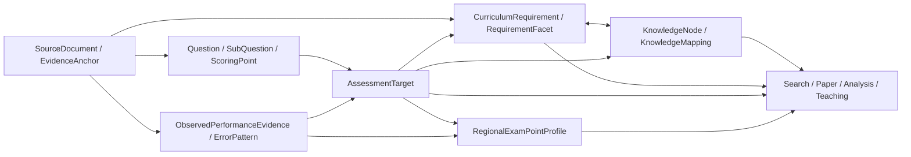

# 课程标准与中考真题多层证据提炼设计

- 日期：2026-07-28
- 状态：设计文档已确认，待实施计划批准
- 设计选择：方案 3，多层证据模型
- 当前范围：初中物理、2022 年版 2025 年修订课程标准、广州 2015-2025 中考真题/答案/年报
- 主要用途：教师题目检索、组卷、学情诊断，兼顾后续备课与教学改进

## 1. 背景与当前真值

本仓已经有版本化知识资产、课标条目、地区考点、题目标签、能力维度、难度候选、来源证据和 C002R 审核激活链路。现有结构证明“多层模型”已有落点，但尚未把四个容易混淆的概念收紧为统一语义：

- 知识节点是相对稳定的学科内容资产。
- 课程要求是某一课标版本的规范性陈述。
- 考查目标是单题、小问或评分点实际意图测量的组合。
- 地区考查画像是跨题、跨年证据聚合后的区域考试事实。

2026-07-28 核对的 OCR 课程标准文件为：

`D:\KQG_Data\source_materials\imported\《义务教育物理课程标准·日常修订版》(2022年版2025年修订).pdf`

当前文件事实：

- 67 页，1,689,021 bytes。
- SHA-256：`E00A5665E7E17EA6BDD6236D9366C51C63BBE6CC0EABF83AC3D0A529C487DD8C`。
- 可提取文本约 42,217 字符。
- 目录、课程内容、学业质量、评价建议和学业水平考试页面的 OCR 阅读顺序与视觉版面一致。
- 课标明确包含五个一级主题、二级主题、三级内容要求、学业要求、教学提示、学业质量、核心素养和命题建议，不能压缩为单一知识点清单。

广州 2015-2025 真题批次同时包含试卷、答案/解析和考试年报。年报可提供题目设计意图、课标或教材依据、实测难度、选项或得分分布、典型错误、错因及教学建议。试卷负责题目事实，答案负责评分事实，年报负责实测与解释证据，三者不可互相替代。

## 2. 目标与非目标

### 2.1 目标

1. 建立“来源 -> 规范 -> 知识 -> 题目任务 -> 实测表现 -> 地区画像”的可追溯数据链。
2. 支持题目按知识、课标要求、能力、认知要求、方法、实验、情境、题型和难度检索与组卷。
3. 支持把小题得分、典型错误和错因回收到知识与能力诊断，而不把相关性误报为确定因果。
4. 保留课程标准版本、广州考试时间窗口和历史题目快照，避免新版本静默污染旧试卷与旧学情报告。
5. 让规则和 AI 承担批量候选提炼，让教师只审核低置信度、高影响或语义冲突项。
6. 区分历史考试的同期课标依据与面向当前课标的后设对齐，避免把后来的标准投射成当年的命题事实。

### 2.2 非目标

- 不把一条课标句子自动变成一个正式知识节点。
- 不把单道题直接提升为地区考点或趋势。
- 不用图数据库替换当前 PostgreSQL、动态资产和映射机制。
- 不在本设计阶段移动原始 PDF、写数据库或切换当前 `C002 active`。
- 不把 AI 估计难度显示为年报实测难度。
- 不把年报教学建议当作课程标准事实或学生错误的唯一因果解释。
- 不仅凭课程标准和真题重建正式知识本体；教材仍是章节组织和教学口径的独立来源层。
- 不扩张到其他学科、其他地区、现场教师验收或正式发布。

## 3. 统一领域模型

领域词汇以仓库根目录 `CONTEXT.md` 为准。本设计使用六个相互独立但可映射的层。



### 3.1 知识节点

`KnowledgeNode` 回答“物理内容本身是什么”。节点继续沿用现有版本化知识资产机制，至少区分：

- `core_concept`
- `law_formula`
- `model`
- `method`
- `experiment`
- `representation`
- `misconception`

题型、能力维度、课标条目和地区画像不作为知识节点的同义词。它们可以通过 `KnowledgeMapping` 与一个或多个知识节点关联。

### 3.2 课程要求与要求分面

`CurriculumRequirement` 回答“某版课标要求学生达到什么”。每个正式编号条目保留一个权威父记录；当条目包含多个行为时，提炼为一个或多个 `RequirementFacet`，但分面始终指回父条目和原始证据锚点。

`CurriculumAlignment` 表达题目考查目标与某版课标要求的关系，类型固定为：

- `source_cited`：试题年报或其他准入来源明确引用该版本课标条目。
- `contemporaneous_inferred`：根据考试年份和当时有效标准推断，但来源没有直接引用。
- `retrospective_crosswalk`：为当前检索、组卷或趋势分析，把历史题目后设映射到后来的课标版本。

`retrospective_crosswalk` 只能作为分析映射，不能显示为原命题依据。无法确认考试当年有效标准时，不生成 `contemporaneous_inferred`。

例如“经历物态变化的实验探究过程，知道熔点、凝固点和沸点，了解吸热与放热，能说明有关现象”不能被压成“物态变化”一个标签。它至少包含实验经历、事实认识、能量理解和情境应用等不同分面。

课程要求最小字段：

| 字段 | 语义 |
| --- | --- |
| `stable_id` | 包含标准版本和官方条目号的稳定标识 |
| `parent_stable_id` | 一级/二级主题或官方父条目 |
| `standard_version` | `2022-2025-revision` 等明确版本 |
| `official_item_code` | `1.1.3` 等官方编号，没有编号时使用稳定章节锚点 |
| `requirement_type` | `content_requirement`、`academic_requirement`、`academic_quality`、`required_experiment`、`cross_disciplinary_practice` |
| `source_text` | 经核对的原始条文，不由 AI 改写成事实源 |
| `behavior_verbs` | 知道、理解、应用、解释、分析、论证、设计、评估等 |
| `cognitive_demands` | 与行为表现对应的认知要求，可多值 |
| `ability_dimensions` | 核心素养及其子要素，可多值 |
| `knowledge_stable_ids` | 多对多知识映射 |
| `evidence_anchor` | 来源文件 hash、PDF/印刷页、章节、文本块 hash |
| `confidence/review_status` | 提炼与审核状态，不改变来源条文本身 |

### 3.3 考查目标

`AssessmentTarget` 回答“这道题的哪个范围意图测量什么”。它不是地区考点资产，而是从题目派生、可审核和可追溯的记录。

每个目标必须精确绑定以下一种范围：

- `whole_question`
- `subquestion`
- `scoring_point`

考查目标最小字段：

| 字段 | 语义 |
| --- | --- |
| `target_id` | 稳定目标 ID |
| `question_scope` | 题目、小问或评分点引用 |
| `target_statement` | 简短、可审核的测量意图 |
| `primary_knowledge_id` | 主知识节点，最多一个 |
| `secondary_knowledge_ids` | 次要、前置或综合知识节点 |
| `curriculum_alignments` | 课标要求/分面、标准版本、对齐类型、证据与置信度 |
| `ability_dimensions` | 能力/素养维度及子要素 |
| `cognitive_demands` | 信息提取、理解、应用、推理、论证、设计、评估等 |
| `method/model/experiment_ids` | 方法、模型或实验资产引用 |
| `context_type` | 日常生活、生产工程、科技、自然、实验、跨学科等 |
| `representation_types` | 文本、公式、图像、图表、表格、装置、数据等 |
| `task_type` | 选择、填空、计算、作图、实验、解释、论述、开放任务等 |
| `score_weight` | 该目标对应分值；无法拆分时显式为空 |
| `evidence_anchors` | 试卷、答案/解析和年报证据 |
| `generation/review` | 规则、AI、人工来源及审核状态 |

一道题允许有多个考查目标，但必须有清晰的主目标。无法可靠拆分的综合题保留整体目标和不确定性，不强行制造评分点事实。

### 3.4 实测表现证据

`ObservedPerformanceEvidence` 只保存年报或正式统计给出的事实。最小字段包括：

- 来源年报、年份、题号、小问或评分点。
- 满分、平均分、得分率、实测难度。
- 难度量表方向；广州年报当前口径按“系数越高越容易”保存，不能与 hardness 混用。
- 区分度、选项分布、未选率、零分率、满分率等来源实际提供的指标。
- 原始统计值、单位、样本范围和证据锚点。
- 缺失字段保持 `null`，不得用 AI 或邻近年份补写成实测事实。

`difficulty_estimated`、`difficulty_observed` 和 `teacher_confirmed` 保持不同来源。聚合值必须能回溯到原始观察记录，历史报告继续冻结其当时引用的版本。

### 3.5 错误证据与错误模式

年报中的“典型错误”“错因”和“教学建议”拆成三类记录：

1. `ObservedErrorEvidence`：来源原文或可核对摘要，绑定题目范围与证据锚点。
2. `ErrorPattern`：经归一化的错误类型，如概念误解、模型未建构、单位换算、读图、实验操作、数据处理、表达规范或粗心遗漏。
3. `TeachingRecommendation`：年报或教师提出的教学建议，保留作者与来源，不视为课标事实。

单次错误不能自动形成稳定 `Misconception`。只有跨题或跨年重复、语义一致且经审核的概念性错误，才可映射或提升为知识资产中的 misconception。

### 3.6 地区考查画像

现有存储类型 `exam_point` 保留以兼容 API、CSV 和 UI，但其领域语义收紧为 `RegionalExamPointProfile`。它回答“广州在某个时间窗口实际如何考”，不回答“物理知识是什么”。

最小字段：

| 字段 | 语义 |
| --- | --- |
| `stable_id` | 地区、学段、学科和画像主题的稳定 ID |
| `region` | 本批为广州 |
| `year_range` | 明确起止年份与可比年份集合 |
| `standard_regime` | 所对应的课标版本或过渡时期 |
| `knowledge_stable_ids` | 涉及的知识组合 |
| `curriculum_alignments` | 带标准版本和对齐类型的课标关系集合 |
| `ability/cognitive dimensions` | 常见能力与认知要求 |
| `common_task/context/representation` | 常见题型、情境与信息载体 |
| `frequency_weight` | 有证据年份中的出现频率，带明确分母 |
| `score_weight` | 在可比试卷总分中的分值权重 |
| `difficulty_distribution` | 实测难度分布，不压成单个固定等级 |
| `trend_status` | `rising/stable/falling/insufficient_evidence` |
| `evidence_target_ids` | 支撑画像的题目考查目标集合 |
| `review/version/status` | 候选、审核与版本状态 |

画像可以在单年证据上创建 `candidate`，但少于三个可比考试年份时，趋势必须为 `insufficient_evidence`。跨课标版本比较必须保留 `standard_regime`，不得直接把制度变化解释为命题趋势。

## 4. 来源登记与材料归宿

### 4.1 课程标准最终目录

课程标准不属于广州真题年份批次。实施时将其迁移到独立版本目录：

`D:\KQG_Data\source_materials\imported\curriculum_standards\physics\junior_middle_school\2022-2025-revision\raw\`

迁移顺序固定为：

1. 在当前位置记录路径、长度、mtime、SHA-256、页数、文本字符数和 PDF magic。
2. 创建目标目录与批次 inventory。
3. 移动 PDF，不删除或覆盖同名目标。
4. 在目标位置重新计算全部事实并要求 hash parity。
5. 更新被 `.gitignore` 排除的 `configs/knowledge/source-material-manifest.local.json`。
6. 只有路径、hash、版本和用途许可全部通过后，批次状态才从 `staged` 进入来源准入。

回滚只把本次文件移回 inventory 中的原路径，并恢复本次 manifest 变更。数据库和 FileStore 尚未写入时，不执行数据恢复。

### 4.2 来源准入字段

课标登记为：

- `materialId=curriculum-physics-junior-2022-2025-revision`
- `sourceType=curriculum_standard`
- `editionOrVersion=2022-2025-revision`
- `gradeOrScope=junior_middle_school`
- `mayUseForKnowledgeExtraction=true`
- `mayUseForExamPointExtraction=false`
- `mayUseForTrendAnalysis=false`

真题可用于知识候选、考查目标和地区画像；答案/解析用于评分与解题证据；年报用于考查目标解释、实测指标、错误模式和趋势。每类用途必须由 manifest 明确授权，不能按文件名猜测。

## 5. 提炼流程

### 5.1 课程标准

1. 解析目录、标题层级、官方条目号、印刷页和 PDF 页。
2. 建立一级主题、二级主题和官方三级条目父记录。
3. 保留原始条文并生成证据锚点。
4. 将复合条目拆成要求分面，提取行为动词、内容对象、条件、认知要求、能力维度、实验和情境要求。
5. 与当前 `KnowledgeNode` 做多对多候选映射；资产对齐使用现有 `equivalent/broader/narrower`，前置关系继续由知识边或题目知识映射中的 `prerequisite` 表达，不混用枚举。
6. 未匹配内容只能生成新知识候选，不直接写入 active。
7. 用学业要求和学业质量描述校验分面是否遗漏能力与表现要求。
8. 教材继续提供章节、教学顺序和校本口径映射；课标与真题提炼不得覆盖教材层。

### 5.2 真题、答案与年报

1. 复用现有题目、小问、评分点和来源区域结构，不重新发明题目主键。
2. 先提取年份、题号、题型、分值和来源页等确定性事实。
3. 从试卷提炼任务、情境、表征和候选知识组合。
4. 从答案/解析提炼评分点、必要步骤、关键依据与允许的合理答案。
5. 从年报提炼命题意图、课标/教材依据、实测指标、错误证据和教学建议。
6. 以题号、小问、评分点和来源锚点对齐三类资料；文件名相似不构成关联证据。
7. 课标关系必须标记 `source_cited/contemporaneous_inferred/retrospective_crosswalk`；2015-2025 真题不能仅因当前导入了 2022/2025 课标就统一标成该标准的命题依据。
8. 生成 `AssessmentTarget candidate`，保留每个字段的来源和置信度。
9. 来源冲突进入审核队列，不能用 AI 选择一个版本后静默覆盖。

### 5.3 地区画像聚合

1. 只从已审核或明确标记候选状态的考查目标聚合，正式画像不得混入未标识状态的数据。
2. 计算完整 2015-2025 历史窗口和最近五个可比考试年份的滚动窗口。
3. 分母使用实际可用试卷、题目范围或可比总分，并随指标保存。
4. 分别计算出现频率、分值权重、知识共现、能力/认知分布、题型、情境、表征和实测难度分布。
5. 年份资料缺失、评分口径不同或课标制度变化时，降低可比性并阻止趋势结论。
6. 聚合结果始终先进入 `candidate/pending_review/productionEligible=false`。

## 6. AI、规则和社区工具边界

### 6.1 责任分工

- 规则负责目录编号、题号、年份、分值、显式统计值、hash 和已知稳定映射。
- AI 负责复合条目分面、考查目标、语义映射、情境/表征分类和错误模式候选。
- 教师负责低置信度、复合目标、课标边界、新知识节点、地区画像和生产激活。
- 任何 AI 输出都记录模型角色、prompt/schema 版本、输入/输出 hash、成本、置信度和审核状态。

### 6.2 工具选择

第一实施切片复用当前 Poppler、MiKTeX 文本提取、Python/schema 和仓库 adapter，不新增依赖。只有 golden fixture 证明现有能力不足时，才评估：

- PyMuPDF：页级文本与坐标提取。
- Docling：复杂布局和表格结构候选。
- RapidOCR、OCRmyPDF 或 Tesseract：无文本层或低质量扫描页回退。

候选工具必须满足开源免费、许可证可接受、Windows 可运行、可离线、版本可锁定、能卸载回滚，并通过真实课标页、真题页、公式、表格和中文 OCR fixture 对比。工具安装优先仓库 profile 或隔离环境，不做无证据的系统级预装。

## 7. 审核、版本与激活

本批所有提炼结果初始均为：

```text
candidate
pending_review
productionEligible=false
```

高置信度一对一映射可以自动生成建议，但不能绕过正式激活。以下情况必须人工审核：

- `confidence < 0.85`。
- 一拆多、多合一、多对多或新知识节点。
- 一道题有多个可能主目标。
- 课标条文、答案和年报之间存在冲突。
- 影响历史题目、组卷约束、学情报告或已发布导出。
- 地区画像涉及跨课标版本趋势。
- 错误证据拟提升为稳定 misconception。

当前 `C002 active` 不原地修改。新课标和真题提炼走：

```text
source admission
-> source-derived candidate
-> draft/formal mapping
-> migration impact report
-> review workbench
-> rollback snapshot
-> C002R reviewed version
-> admin active switch
```

旧题、旧卷和旧学情报告继续引用旧版本；新查询默认读取当前 active，但必须能解释历史版本。

## 8. 教师工作流

教师侧不展示底层全部字段。默认工作流为：

1. 查看课标条目与候选知识映射。
2. 查看题目原页、答案、年报证据和候选考查目标。
3. 只处理冲突、低置信度和高影响项。
4. 在检索和组卷中使用知识、课标要求、能力、认知、情境、题型、地区画像和难度筛选。
5. 在学情分析中区分知识掌握、能力表现、错误模式和实测难度。

管理员负责来源准入、版本、影响报告、快照、active 切换和回滚。普通教师不承担存储路径、hash、模型路由和迁移计划等运维字段。

## 9. 失败处理

- OCR 或版面解析不完整：保留页级诊断，切换 adapter；仍失败则进入人工接管，不生成缺证据正式条目。
- 课标编号或层级冲突：保留原文和两个候选结构，阻断该分支正式化。
- 真题、答案和年报题号不一致：只标记已证明的关联，异常题进入审核队列。
- 年报指标量表不明确：原文留存，数值不进入统一聚合。
- 历史考试的同期课标版本无法确认：只允许后设对齐或保持无映射，不伪造原命题依据。
- AI schema、置信度或来源锚点缺失：整条候选 fail-closed。
- 多年聚合样本不足：画像可保持候选，但趋势为 `insufficient_evidence`。
- 文件迁移 hash 不一致：停止并按 inventory 回滚，不更新 manifest 或数据库。
- C002R 影响报告或快照缺失：禁止 reviewed -> active。

## 10. 验证设计

### 10.1 来源与解析

- PDF hash、页数、文本字符数和渲染非空。
- 目录页、课程内容页、学业质量页和命题建议页 golden fixture。
- PDF 页与印刷页映射稳定。
- 官方条目号唯一，父子层级无环，来源锚点可回看。

### 10.2 模型与映射

- `CurriculumRequirement`、`RequirementFacet`、`AssessmentTarget`、`ObservedPerformanceEvidence` 和 `RegionalExamPointProfile` schema 解析。
- 课标要求与知识节点多对多映射保持版本和证据。
- 同期课标依据、来源明示引用与后设对齐可被查询和 UI 明确区分。
- 每个考查目标精确绑定题目、小问或评分点。
- 单题不会自动成为正式地区画像。
- 实测难度和估计难度不会混用或覆盖。

### 10.3 聚合与诊断

- 频率和分值权重保存分子、分母与可比年份。
- 少于三个可比年份时不产生上升/下降趋势。
- 年报缺失字段保持空值。
- 错误证据、错误模式、misconception 和教学建议保持不同类型。
- 历史题单和报告继续解析到原版本。

### 10.4 审核与安全

- 所有自动提炼默认 `pending_review/productionEligible=false`。
- 低置信度、高影响和复杂映射进入审核队列。
- 未授权来源、未脱敏 PII 和不允许外部处理的材料 fail-closed。
- active 切换前具备 impact report、backup manifest、snapshot 和 rollback command。

实现阶段门禁顺序固定为 `build -> test/full -> contract/invariant -> hotspot`。本设计文档本身不证明解析器、数据库、UI 或 C002R 已实现。

## 11. 实施切片边界

用户复核本设计后，实施计划应拆成以下有序切片：

1. 课程标准 inventory、版本目录迁移、manifest 和回滚入口。
2. 课程要求/分面 schema、模板、OCR 结构提取和 golden fixture。
3. 考查目标 schema 及真题、答案、年报三源对齐。
4. 实测表现、错误证据、错误模式和教学建议结构化。
5. 地区考查画像聚合、可比性和趋势门禁。
6. C002R 映射、影响报告、审核工作台和 active 切换演练。
7. 教师检索、组卷、学情分析和历史版本解释。
8. 完整门禁、备份恢复、证据和状态文档收口。

每个切片必须包含输入、输出、验收标准、验证命令、证据路径和只回滚该切片的入口。不得以设计批准代替实施完成，也不得以 repo-side 自动化代替教师审核或现场验收。

## 12. 完成边界

本设计批准并写入仓库，只表示以下决策已确定：

- 采用多层证据模型。
- 知识节点、课程要求、考查目标和地区考查画像具有不同语义。
- 课标、试卷、答案和年报保留各自证据责任。
- AI 只生成候选，C002R 与人工审核继续 fail-closed。

它不表示课程标准已经迁移、全部条目已经提炼、广州真题已经重新标注、数据库已经写入、C002R 已激活或产品已经验收。上述结果必须由后续实施计划、真实门禁和证据分别证明。
